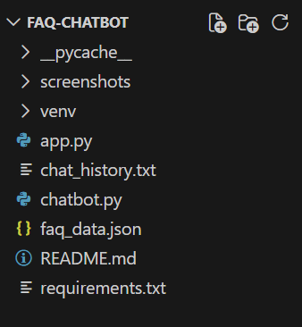
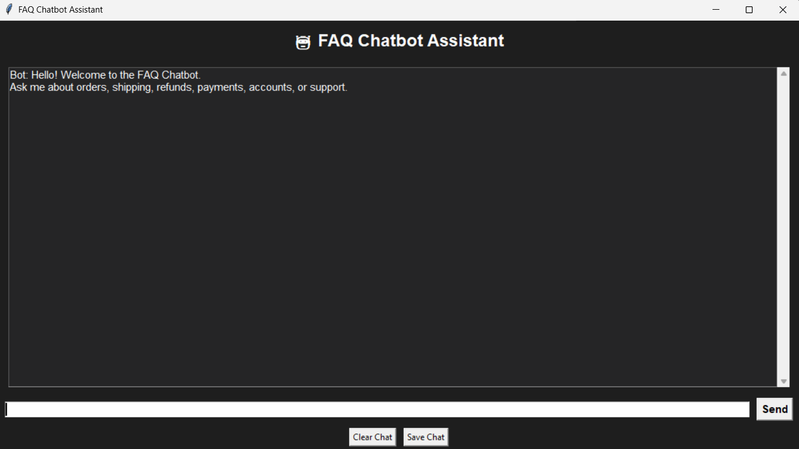
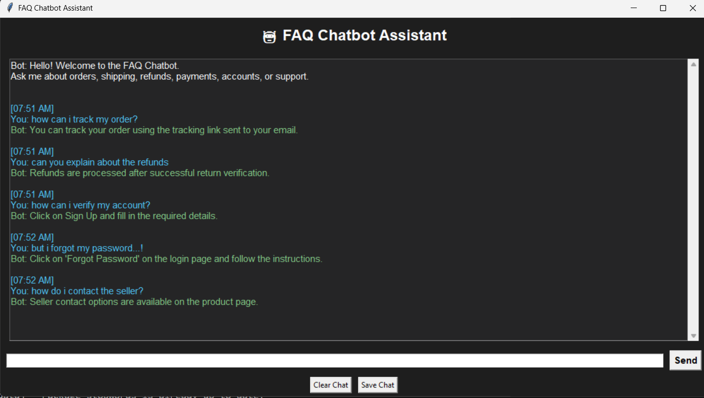

# 🤖 FAQ Chatbot using NLP

## Overview

This project is an AI-powered FAQ Chatbot developed using Python and Natural Language Processing (NLP). The chatbot is designed to automatically answer frequently asked e-commerce customer support questions related to orders, shipping, payments, refunds, and account management.

Instead of relying on exact keyword matching, the chatbot uses TF-IDF Vectorization and Cosine Similarity to understand user queries and identify the closest matching FAQ.

The application also provides a simple graphical user interface built with Tkinter for real-time interaction.

---

## Features

* Interactive chatbot interface
* NLP-based question matching
* FAQ dataset stored in JSON format
* Text preprocessing using NLTK
* TF-IDF Vectorization for text representation
* Cosine Similarity for intelligent FAQ matching
* Real-time chatbot responses
* Timestamped conversations
* Clear chat functionality
* Save chat functionality
* Enter key support for quick interaction
* Scrollable chat window
* User-friendly dark-themed interface

---

## Technologies Used

* Python
* NLTK
* Scikit-Learn
* Tkinter
* JSON
* TF-IDF Vectorization
* Cosine Similarity

---

## Project Structure

### Project Folder Structure



---

## How It Works

1. FAQ data is loaded from a JSON file.
2. Questions are preprocessed using NLTK.
3. TF-IDF Vectorization converts text into numerical representations.
4. Cosine Similarity calculates similarity between the user's query and stored FAQs.
5. The most relevant FAQ is selected.
6. The corresponding answer is displayed to the user.
7. If no suitable match is found, the chatbot displays a fallback response.

---

## Installation

### Clone the Repository

```bash
git clone <repository-link>
cd FAQ-Chatbot
```

### Create a Virtual Environment

```bash
python -m venv venv
```

### Activate Virtual Environment

Windows:

```bash
venv\Scripts\activate
```

### Install Dependencies

```bash
pip install -r requirements.txt
```

---

## Running the Project

```bash
python app.py
```

---

## Screenshots

### Main Interface



### Chatbot Response Example



---

## Sample Questions

You can ask questions such as:

* How can I track my order?
* What is your return policy?
* How do I reset my password?
* Can I cancel my order?
* Do you offer refunds?
* How can I contact customer support?
* Is cash on delivery available?
* How long does shipping take?

---

## Learning Outcomes

Through this project, I gained practical experience in:

* Natural Language Processing (NLP)
* Text Preprocessing
* TF-IDF Vectorization
* Cosine Similarity
* Building Chatbot Applications
* Python GUI Development using Tkinter
* Working with Structured JSON Data

---

## Future Improvements

* Support for larger FAQ datasets
* Voice-based interaction
* Multi-language support
* Integration with web applications
* Machine Learning-based intent classification

---

## Conclusion

This project demonstrates how Natural Language Processing techniques can be used to build an intelligent FAQ chatbot capable of answering customer support queries efficiently. By combining NLTK, TF-IDF, and Cosine Similarity, the chatbot can understand user questions and provide relevant responses through an interactive graphical interface.

---

## Author

**Snigdha Dashrath Kandikatla**

**GitHub:** https://github.com/Snigdha171106

**This project was developed as part of the CodeAlpha AI Internship.**