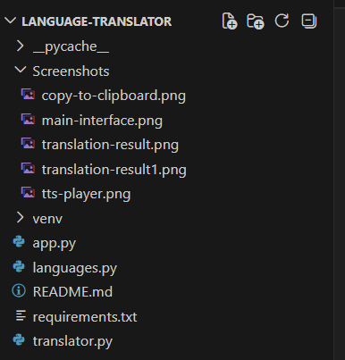
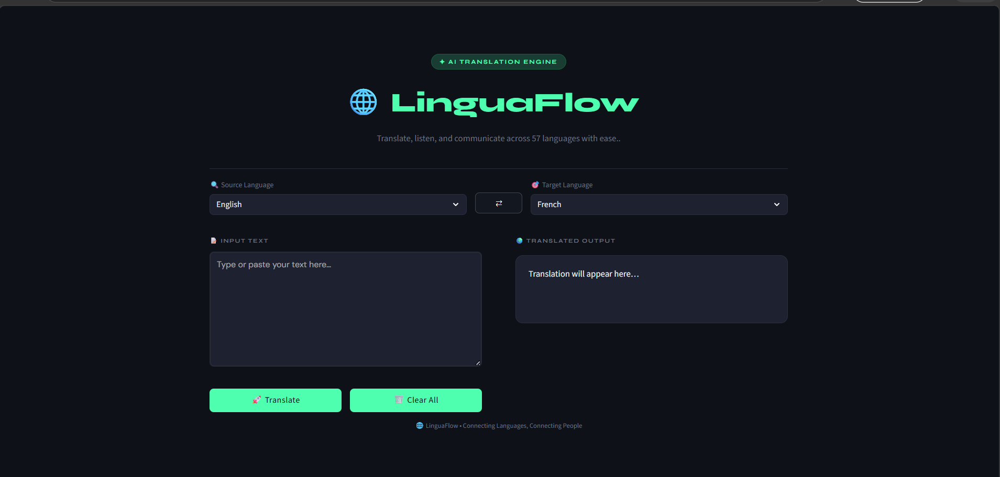
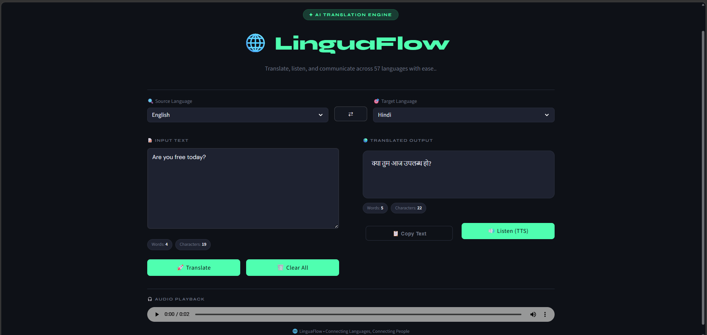
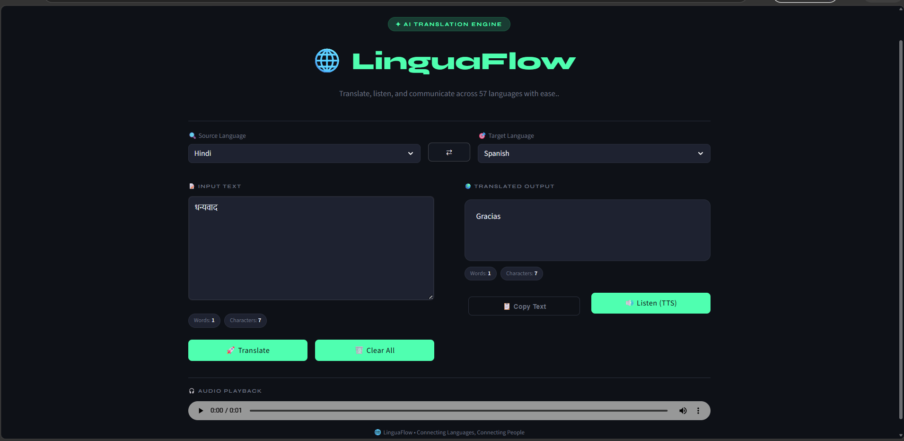
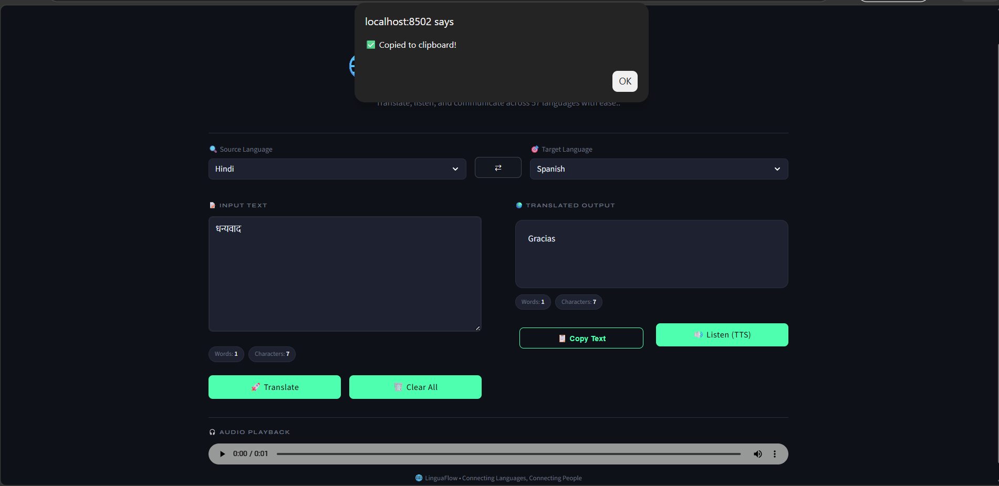
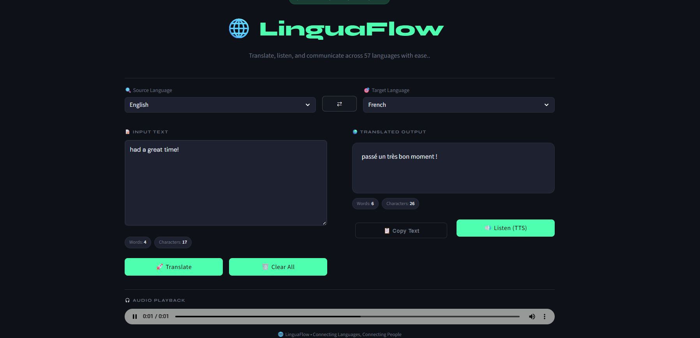

LinguaFlow — Language Translation Tool

**LinguaFlow** is a clean, fully functional language translation web app built from scratch using Python and Streamlit. It translates text across **57 languages**, lets you listen to the translation out loud, and handles all the small things that make a tool actually pleasant to use — like swapping languages with one click, seeing word counts, and getting clear error messages when something goes wrong.

No API keys. No complicated setup. Just clone it, install three packages, and run it.

---

## What it can do

Here's a quick rundown of everything baked in:

- **Translate across 57 languages** — from Afrikaans to Welsh, all the major ones are covered
- **Text-to-Speech** — hit the Listen button and hear the translated text read aloud
- **Copy to Clipboard** — one click and your translation is ready to paste anywhere
- **Language Swap** — flip source and target languages instantly without retyping anything
- **Live stats** — word count and character count update in real time for both input and output
- **RTL support** — Arabic, Hebrew, Urdu, Persian and others automatically flip to right-to-left layout
- **Friendly error messages** — empty input, failed API calls, bad language pairs — all handled gracefully
- **One-click clear** — reset everything and start fresh in a second

---

## Project structure



---

## Tech Stack

**Frontend:** Streamlit, HTML, CSS, JavaScript

**Backend:** Python

**Libraries:** deep-translator, gTTS

The application is lightweight, easy to set up, and runs locally using Streamlit without requiring a database or backend server.

---

## Getting it running

### Step 1 — Make sure Python is installed

```bash
python --version
# Should say 3.10 or higher
```

Don't have it? Grab it from [python.org](https://www.python.org/downloads/).

### Step 2 — Clone the repo

```bash
git clone https://github.com/YOUR_USERNAME/Language-Translator.git
cd Language-Translator
```

### Step 3 — Set up a virtual environment (strongly recommended)

```bash
# Create it
python -m venv venv

# Activate on Windows
venv\Scripts\activate

# Activate on macOS / Linux
source venv/bin/activate
```

This keeps the project's dependencies isolated from your system Python.

### Step 4 — Install the three dependencies

```bash
pip install -r requirements.txt
```

This installs Streamlit, deep-translator, and gTTS. Should take under a minute.

### Step 5 — Run it!

```bash
streamlit run app.py
```

Your browser will open automatically at `http://localhost:8501`. If it doesn't, just open that URL manually.

> NOTE: You need an active internet connection — translation and TTS both call Google's servers in real time.

---

## How to use it

1. Type or paste your text into the left panel
2. Pick your source language from the dropdown on the left
3. Pick your target language from the dropdown on the right
4. Hit **Translate**
5. The result appears instantly on the right
6. Want to hear it? Click **Listen (TTS)** — an audio player will appear below
7. Need to copy it? Click **Copy Text**
8. Want to flip the languages? Click the swap button ( < > ) — it also moves your translated text back into the input
9. Done? Hit **Clear All** to start fresh

---

## How it's built under the hood

A few things worth knowing if you're reading the code:

**Session state** — Streamlit reruns the entire script on every interaction. All the app's data (current text, translation, audio bytes) lives in `st.session_state` so nothing gets wiped between button clicks.

**Modular design** — The UI (`app.py`), translation logic (`translator.py`), and language data (`languages.py`) are deliberately separated. If you want to swap Google Translate for DeepL tomorrow, you only touch one function in `translator.py`.

**RTL detection** — `is_rtl_language()` checks the target language code against a set of known RTL languages and adds a CSS class to the output box, which flips the text direction automatically.

**Clipboard copy** — Streamlit doesn't have a native clipboard API, so a tiny vanilla JavaScript snippet injected via `st.components.v1.html` handles the copy using the browser's `navigator.clipboard` API.

---
## Screenshots

### Main Interface



### Translation Result





### Copy to Clipboard



### Text-to-Speech Output



---

## What I'd add next

This is a solid v1, but there's plenty of room to grow:

- **File translation** — drag in a `.txt` or `.pdf` and translate the whole thing
- **Translation history** — keep a log of past translations within the session
- **Pinned language pairs** — remember your favourite source/target combo
- **Confidence scores** — show how certain the translation engine is
- **DeepL integration** — optional higher-quality translation for supported languages

---

## Internship checklist

Everything required for the CodeAlpha AI Internship submission:

- Streamlit-based responsive UI with custom styling
- 57 supported languages with ISO 639-1 codes
- Google Translate integration — no paid API key required
- Translate button
- Copy to Clipboard button
- Clear button
- Text-to-Speech (listen to translated output)
- Language swap button
- Translation statistics — word count and character count
- RTL language layout support
- Success and error message handling
- Clean, modular, well-commented code across multiple files
- Full exception handling for empty input, API failures, bad language pairs
- `requirements.txt` with version-pinned dependencies
- Professional README

---

## About this project

**Snigdha Dashrath Kandikatla**
CodeAlpha AI Internship — June 2026
[GitHub](https://github.com/Snigdha171106/Language-Translator)

This project was developed as part of the CodeAlpha AI Internship. The goal was to make something genuinely useful, not just a homework submission — a tool I'd actually want to open when I need a quick translation.
