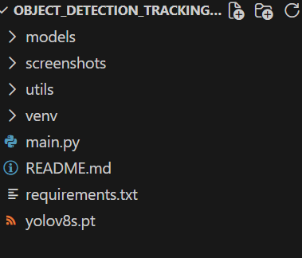
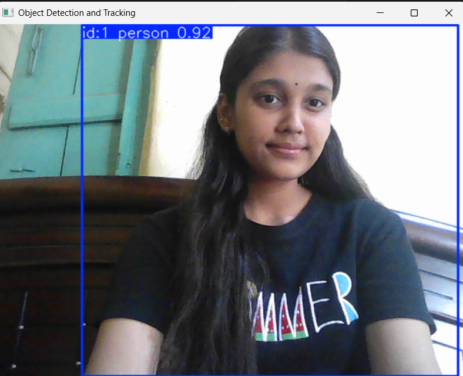
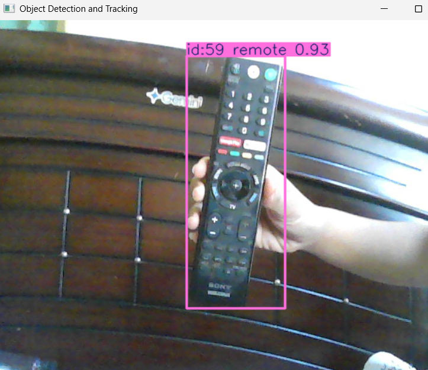
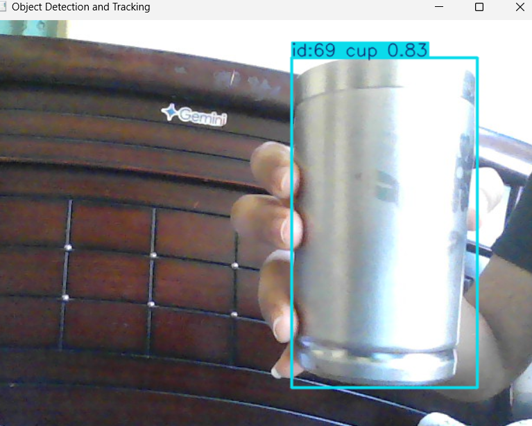
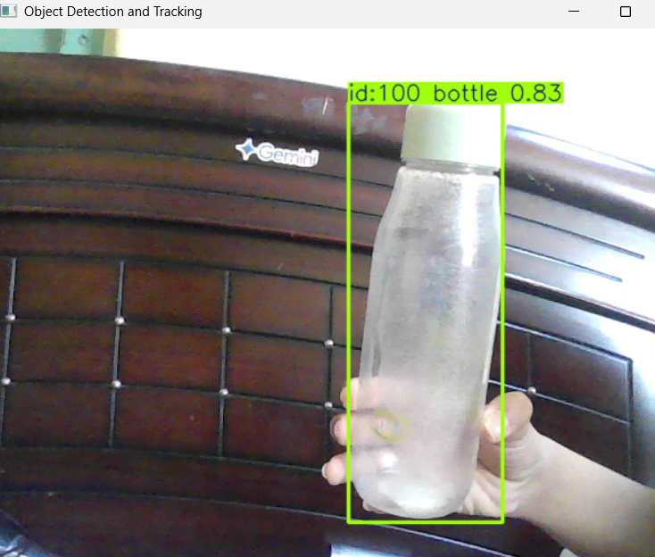
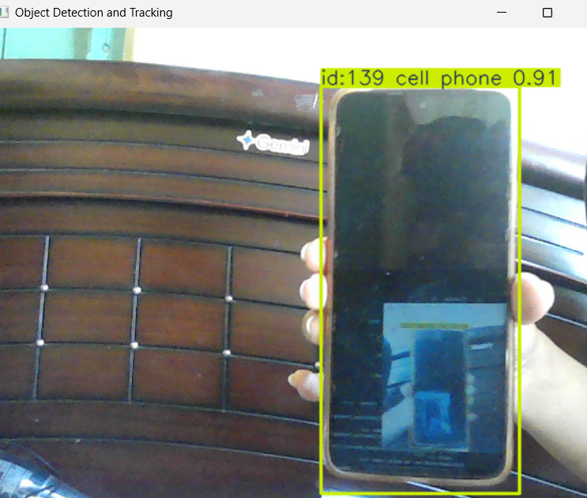

# Object Detection and Tracking using YOLOv8

## Overview

This project performs real-time object detection and tracking using a webcam feed. It utilizes the YOLOv8 model to identify objects in each video frame and assigns unique tracking IDs to detected objects, allowing them to be tracked continuously as they move.

The system displays bounding boxes, object labels, and tracking IDs in real time.

---

## Features

* Real-time video capture using OpenCV
* Object detection using a pre-trained YOLOv8 model
* Real-time object tracking with unique IDs
* Bounding box visualization around detected objects
* Object labels displayed on screen
* Live tracking of multiple objects simultaneously
* Lightweight and easy-to-use implementation

---

## Technologies Used

* Python
* OpenCV
* YOLOv8 (Ultralytics)
* NumPy

---

## Project Structure

The following image shows the organization of the project files and folders.



---

## How It Works

1. The webcam captures live video frames.
2. Each frame is processed using the YOLOv8 model.
3. Objects are detected and classified.
4. Tracking IDs are assigned to detected objects.
5. Bounding boxes, labels, and IDs are displayed on the video feed.
6. The process continues in real time until the user exits the application.

---

## Installation

### Clone the Repository

```bash
git clone <repository-link>
cd Object_Detection_Tracking
```

### Create a Virtual Environment

```bash
python -m venv venv
```

### Activate the Virtual Environment

Windows:

```bash
venv\Scripts\activate
```

### Install Dependencies

```bash
pip install -r requirements.txt
```

---

## Running the Project

```bash
python main.py
```

Press **Q** to close the application window.

---

## Screenshots

### Real-Time Object Detection



### Object Detection with Tracking IDs









---

## Sample Output

The system can detect and track common objects such as:

* Person
* Cell Phone
* Bottle
* Laptop
* Backpack
* Chair
* Keyboard
* Book

Detected objects are highlighted with bounding boxes and assigned unique tracking IDs for continuous tracking.

---

## Learning Outcomes

Through this project, I gained practical experience in:

* Computer Vision
* Real-Time Video Processing
* Object Detection
* Object Tracking
* OpenCV Integration
* Working with Pre-trained Deep Learning Models

---

## Conclusion

This project demonstrates the implementation of real-time object detection and tracking using modern computer vision techniques. By combining OpenCV and YOLOv8, the system is able to detect and track objects efficiently in a live video stream.

---

## Author

**Snigdha Dashrath Kandikatla**

This project helped me explore real-time computer vision applications and gain hands-on experience with object detection and tracking using YOLOv8s and OpenCV.

**GitHub:** [Add GitHub Profile Link]

---

⭐ Developed as part of the CodeAlpha AI Internship Program
